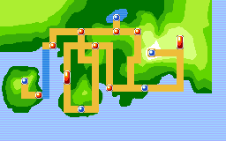
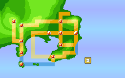

[Home](Home.md) · [Guide](Game-Guide.md) · [Changes](Changes.md) · [Pokédex](Pokedex.md) · [Locations](Locations.md) · [Routes & Cities](Routes-and-Cities.html) · [Bosses & Tips](Bosses-and-Tips.md) · [Credits](Credits-and-Versions.md) · [Roadmap](Roadmap.md) · **[FR](../FR/Guide-de-jeu.md)**

# Guide — concise walkthrough

This page is mainly a **where-do-I-go-next walkthrough**. It follows the main Heart & Soul story flow, adapted to Pokémon Tactica. Optional detours, minor items and wild encounters are intentionally left out: use **Pokédex**, **Locations** and **Bosses & Tips** to build and prepare your team.

> Pokémon, levels, bosses and encounters come from Tactica. The Heart & Soul walkthrough is used only as a reference for story order and locations.

## Start → Badge 1: Falkner

**New Bark Town** — configure your options and choose your first Tactica starter in Professor Elm's lab. Cross **Route 29 → Cherrygrove → Route 30**, reach Mr. Pokémon and receive the Mystery Egg / Pokédex. Fight your rival on the way back, then return to **Elm's lab** for the theft and police sequence. **This is where Tactica offers the second starter**: identify the Egg species, choose a species different from your first starter, then keep the Egg and receive any associated items. Continue through Routes 30 and 31 to **Violet City**, clear Sprout Tower and defeat **Falkner**.

**Tactica cap: 17.**

## Badge 1 → Badge 2: Bugsy

After Falkner, continue the normal Violet City progression and head south through **Route 32 → Union Cave → Route 33**. The later event with **Elm's aide does not unlock the second starter**; that choice already happened in Elm's lab after the theft/police sequence. In **Azalea Town**, help Kurt and clear Team Rocket from Slowpoke Well. Defeat **Bugsy**, then prepare for the rival battle while leaving toward Ilex Forest.

**Tactica cap: 25.**

## Badge 2 → Badge 3: Whitney

Continue through **Route 34** to **Goldenrod City**. Explore the **Underground** if needed, then visit the **Radio Tower**. Complete the Radio Tower quiz so Whitney returns to her Gym. Defeat **Whitney**. Afterward, visit the **Flower Shop** to obtain the item used on Sudowoodo on Route 36.

**Tactica cap: 32.**

## Badge 3 → Badge 4: Morty

Head north through **Route 35**, **National Park**, then **Route 36**. Use the Goldenrod item on **Sudowoodo**; obtain **Rock Smash** afterward. Continue through **Route 37** to **Ecruteak City**. Resolve the Rocket incident at the **Dance Theater** to obtain **Surf**. Explore the **Burned Tower**: the rival fight and legendary-beast event happen here. Challenge **Morty**. In Tactica, after the Badge and TM, Morty also gives the **Mega Ring**. Mega Evolution becomes available immediately, including the full section **between Badge 4 and Badge 5**.

**Tactica cap: 38.**

## Badge 4 → Badge 5: Chuck

Travel west via **Routes 38 and 39** to **Olivine City**. Climb the **Lighthouse** and talk to Jasmine next to Amphy; she sends you for medicine. Surf across **Routes 40 and 41** to reach **Cianwood City**. Obtain the **SecretPotion** from the pharmacy. Defeat **Chuck**; obtain **Fly** from the intended NPC afterward.

**Tactica cap: 45.**

## Badge 5 → Badge 6: Jasmine

Return to the top of the **Olivine Lighthouse** and give Jasmine the SecretPotion. Once Amphy is healed, Jasmine returns to her Gym. Defeat **Jasmine**.

**Tactica cap: 52.**

## Badge 6 → Badge 7: Pryce

From Ecruteak, head east through **Route 42** to **Mahogany Town**. Travel through **Route 43** to the **Lake of Rage** and finish the Red Gyarados / Lance event. Return to Mahogany and infiltrate the **Rocket Hideout** under the shop. Finish the hideout, then defeat **Pryce**.

**Tactica cap: 57.**

## Badge 7 → Badge 8: Clair

After Pryce, return to **Goldenrod City**: Team Rocket has taken over the **Radio Tower**. Clear the Radio Tower, then the **Underground** section with the rival fight, and finish the Rocket takeover. Head east again: **Route 44 → Ice Path**. Pick up **Waterfall** while crossing. Reach **Blackthorn City** and defeat **Clair**. After the battle, complete **Dragon's Den** to fully validate the eighth Badge.

**Tactica cap: 64.**

## First League

Return to **New Bark Town** for Elm's reward. Complete the mandatory **Kimono Girls** sequence in Ecruteak and the inherited HnS legendary story sequence that opens the League route. From New Bark, cross **Route 27 / Tohjo Falls**, then **Route 26**. Clear **Victory Road**; the rival waits near the end. Enter the **Indigo Plateau** and defeat the **Elite Four and Champion**.

**Tactica caps: Elite Four = 67 · Champion = 70.**

## Kanto → second League

Kanto is more open, but this route gives a clear main progression:

After the first League, obtain the **S.S. Ticket** from Elm and sail from **Olivine** to Kanto. **Vermilion City** — defeat **Lt. Surge**. Reach **Saffron City** and defeat **Sabrina**. Continue to **Celadon City** and defeat **Erika**. Travel down Cycling Road to **Fuchsia City** and defeat **Janine**. Head toward **Lavender / Power Plant** and complete the **Machine Part** quest. Return to **Cerulean City**, finish the Rocket sequence, then defeat **Misty**. Obtain the Radio upgrade in **Lavender**, wake Snorlax near Vermilion and cross **Diglett's Cave**. Reach **Pewter City** and defeat **Brock**. Continue through **Route 3 → Mt. Moon** for another rival battle. Reach **Cinnabar Island / Seafoam Islands** and defeat **Blaine**. With 15 Badges, speak to **Blue** on Cinnabar, then return to **Viridian City** for the sixteenth Badge. Return to the **Indigo Plateau**: the rival challenges you before the **second League**, then the Kanto Elite Four is available.
